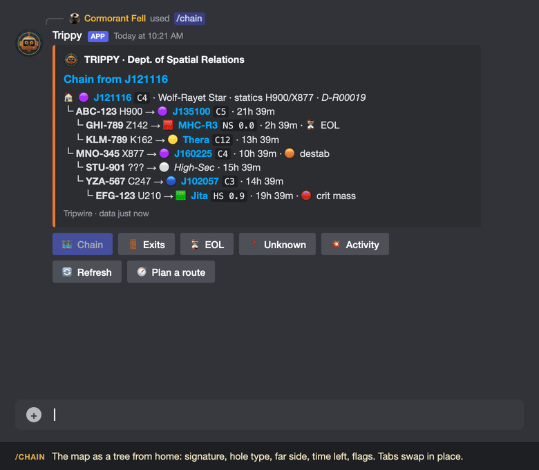

# TRIPPY

[](https://nodejs.org)
[](https://discord.js.org)
[](LICENSE)


> [Cormorant Fell](https://evewho.com/character/93594488), wormhole resident, and a man who has asked "which hole did we come in through" more often than he has been answered, built this. It reads the map. It answers in the channel. It never touches the map itself.

**Department of Spatial Relations · Chain Intelligence Desk · Corporation Edition**

TRIPPY, named for Tripwire and for the trips it takes you on, is a Discord bot
that reads a [Tripwire](https://bitbucket.org/daimian/tripwire) map through
its HTTP API and answers the questions a wormholer asks in the middle of
something else: what does the chain look like, where are the exits, what is
about to die, who scanned this. Tripwire itself records wormhole connections
and the signatures in each system; it has no idea how to get anywhere. Trippy
adds the routing: it joins the live chain to the stargate map and plans a
route from where you are to where you are going, through holes and gates
alike. It also watches the map and announces what changes, each kind of
announcement on its own switch, and narrates kills in the chain as zKillboard
files them.

It reads. It never writes to Tripwire. The scanners do the scanning; Trippy does
the paperwork.

```
FORM DSR-01 (CHAIN INTELLIGENCE)

THE DEPARTMENT OF SPATIAL RELATIONS REPORTS THE MAP AS IT WAS AT
THE LAST POLL, AND MAKES NO REPRESENTATIONS REGARDING THE MAP AS
IT IS NOW. A SCAN IS A PROMISE. A MAP IS A RUMOUR.

EVERYTHING BELOW OBSERVES; NOTHING BELOW JUDGES.
THE MINISTRY IS MERELY NOTING.
```

---

<p align="center"></p>

*`/chain`, the Exits tab, then `/route Jita J135100` and its 📜 detail: four holes, the strip, and the line you paste into fleet chat. The replies are the bot's real output on a demo map; every system and signature is made up.*

---

## What It Does

**The chain is a tree, in a panel.** `/chain` draws the map outward from home,
or from any system you name, with the signature, the hole type, the far side,
the time left and the flags on every branch. The panel has five tabs that swap
in place (Chain, Exits, EOL, Unknown, Activity), a select to root the view at
another home or an unconnected fragment, Refresh, and Plan a route. One message;
click it into whatever you need.

**Routes through holes and gates alike.** `/route` plans from where you are to
where you are going across the live chain *and* the stargate map, with
EVE-Scout's public Thera and Turnur holes as extra edges. The reply is a strip
of coloured squares and circles you can read at a glance, a Short Circuit line
to paste in game, and a row of controls that recompute the route in place:
shorter, safer or less secure; skip EOL, critical or reduced holes; honour the
avoid list; a ship-size select so a battleship is never sent at a frigate hole.
The form takes "Jita to Rens" typed into one box. See [The Route Form](#the-route-form).

**Signatures and notes, where you are.** `/sigs` lists a system's signatures,
wormholes first, with what each hole leads to and how long it has; a select
switches system without a new command. `/notes` reads Tripwire's comments on a
system or searches every note for a phrase, with Tripwire's HTML rendered as
Discord markdown.

**It announces, but only what you asked for.** Every kind of alert, from a new
exit or a hole going heavy to a ghost to delete, a wanted system arriving or a
kill in the chain, has its own switch in `/alerts`. Out of the box the chain
chatter is off, because a big nomadic map produces far too much of it, and the
explicit asks are on. A corp that maps only its home chain can turn the rest
on with one click each. See [Alerts](#alerts).

**Kills, with the chain context a scout wants.** Trippy walks zKillboard's live
feed and posts any kill in a mapped wormhole system: what died, to whom, for
how much; the gang and the corps in it; **who scanned each hole into that
system**, with the sig and when it was first seen; the nearest k-space exit and
the path to it; Route there, Route home and Sigs buttons under the embed.

**Lists that remember.** `/avoid` keeps systems a route should steer around.
`/watch` names places you care about: a new hole within N gates of one, or
anywhere in a watched region, is announced with a 📍 line whatever the alert
switches say. `/wanted` pings you the moment a system you are waiting for lands
on the map. Each list is per Discord server; the map is shared.

**Unknown holes, found and filed.** The automapper leaves k-space↔k-space wormhole rows
with no sig IDs when it follows a pilot through gates. `/unknown` lists them
with scanner and age so somebody can delete them, and separates out the rows
that are probably real holes nobody has identified. A server-side purge script
for the Tripwire admins is included.

**It reads Tripwire and nothing else of yours.** A Tripwire account login, the
map's mask, and a Discord token. No EVE SSO, no character data, no writes.
Access can be gated to a role and a channel, because the map is corp intel.

---

## Commands

| Command | What it does |
| --- | --- |
| `/chain [from]` | The chain panel: a tree from home (or any system), with tabs that swap in place (Chain, Exits, EOL, Unknown, Activity), a "root at" select for other homes and fragments, Refresh, and Plan a route. |
| `/route from to` | A route through the chain **and** stargates. `from: home` uses the home system; "Jita to Rens" typed into either box fills both. Controls under the reply recompute it in place. See [The Route Form](#the-route-form). |
| `/exits [from]` | The panel on its Exits tab: every k-space and Thera exit nearest first, with the weakest hole on the way and a "→ system" route button for each. |
| `/eol` | The panel on its EOL tab: connections end-of-life or mass-reduced, soonest first. |
| `/sigs system` | Signatures in a system, wormholes first, with a select to switch system, Notes and Route here buttons. |
| `/notes [system] [find]` | Tripwire's comments on a system, or a text search across all of them, with a Search form button. |
| `/activity [from]` | The panel on its Activity tab: k-space kills and jumps from ESI; J-space kills from the zKillboard feed's last 24 hours, since ESI has none. |
| `/near system` | From any k-space system, the nearest mapped systems by gates across every chain, with the gate path and the size of each chain. |
| `/unknown` | The panel on its Unknown tab: every known-space hole with no sig IDs and no type. **Ghosts** (ends within 3 gates: the automapper drew a hole where a pilot took gates) to delete, **unidentified** holes (far apart: probably real, never scanned) to identify. One line each with the scanner and the age. |
| `/avoid` | The avoid list as a panel: Add opens a form, a select removes, Clear all. Subcommands `add`, `remove`, `list`, `clear`. Per server. |
| `/watch` | The watch list as a panel, same controls. Subcommands `add`, `remove`, `list`. Per server. |
| `/wanted` | Systems people want to hear about the moment they connect: `add`, `remove`, `list`. Per server. |
| `/kills` | Every kill in a chosen system, on the map or not, k-space included: `watch`, `unwatch`, `list`. Per server, with a `dm` option. |
| `/alerts [kind] [state]` | Every kind of alert with its switch. Bare `/alerts` shows the panel; each button toggles that kind. `kind` with `state: on/off` sets one; `kind` alone flips it. Map-wide. |
| `/status` | Health: which Tripwire, which mask, last poll, last error, the kill feed, which alert kinds are off. |

System options autocomplete. Systems already in the chain come first; a bare
six digits is treated as a J-number. Every system name in a reply links to
`TRIPWIRE_URL/?system=<name>`, so a click opens it on the map. Footers name
the map by `TRIPWIRE_LABEL`; the URL is never shown.

Every command takes `quiet: true` to reply only to you; `EPHEMERAL_REPLIES=on`
makes that the default.

**Opsec.** The map is corp intel. `ALLOWED_ROLE_IDS` restricts every command
to members holding one of those roles; `ALLOWED_CHANNEL_IDS` restricts where
they work. `/status` warns when neither is set.

---

## The Route Form

There are three ways in. `/route from: … to: …` from the command line; the
🧭 **Plan a route** button on the chain panel, which opens a form; and the
✏️ **Edit** button under any route, which opens the same form pre-filled.
"→ system" buttons on the Exits and Near replies and **Route there** /
**Route home from there** under a kill alert plan a route from home in one
press.

**The form** has two boxes. *From* is where you are; leave it blank, or type
`home`, for the home system (with several homes, the one nearest the
destination). *To* is where you are going. Either box accepts a pair,
`Jita to Rens`, `Jita > Rens` or `Jita -> Rens`, and fills both. Names
autocomplete on the command; in the form, a name that matches nothing comes
back with suggestions.

**The reply** is one embed, edited in place as you press things:

- **The headline.** Jumps, then holes and gates, then "via EVE-Scout" when a
  public Thera or Turnur hole is on the route.
- **The strip.** One glyph per system, in the client's own route-bar
  convention: 🟩 highsec, 🟧 lowsec, 🟥 nullsec squares, 🔺 Pochven, and circles
  for wormhole space: 🔵 C1 to C3, 🟣 C4 to C6, 🔹 C13, 🟡 Thera, ⚫ drifter holes.
  Gate runs are dots; every wormhole is 🌀. The ends and every system on either
  side of a hole are named and link to Tripwire; the squares between link too,
  so a hover shows the name. With 📜 **Details** on, each 🌀 carries its sig,
  its time left and its flags, and every system in a gate run is named.
- **The Short Circuit line**, in a code block for copying: `-->` for gates,
  `--> ... -->` for a run of them, `[SIG-123] ~~>` for a hole, with the sig
  to warp to after the system you leave. The corp already reads this format.
- **The settings in force**, on one line: mode, ship size, skips, avoid list.
- **🚫 Avoiding**, as a field, when Details is on.

**The controls** sit in three rows. The whole route state is encoded in each
button, so a click needs no session and an old message still works.

| Row | Control | What it does |
| --- | --- | --- |
| 1 | 🏃 **Shorter** | Fewest jumps. The default. |
| 1 | 🛡️ **Safer** | Prefer highsec: each lowsec system costs 50 extra, null, Pochven and J-space 100. Jumps are still counted honestly. |
| 1 | 🔥 **Less secure** | The inverse: highsec costs 50 extra. For when highsec is the dangerous part. |
| 1 | 🔁 **Swap** | Reverse the route. |
| 1 | ✏️ **Edit** | Reopen the form with these ends filled in. |
| 2 | ⏳ **Skip EOL** | No hole flagged end-of-life; no EVE-Scout hole under four hours. |
| 2 | 🔴 **Skip critical** | No hole at critical mass. |
| 2 | 🟠 **Skip reduced** | No hole with any mass reduction, destabilised included. |
| 2 | 🚫 **Avoid list** | Honour this server's `/avoid` list. Green when on; greyed out when the list is empty. A route's two ends are never avoided. |
| 2 | 📜 **Details** | Expand the strip: sigs, time left and flags on every hole, every system in a gate run named, and the avoid list as a field. Off by default so a phone gets the compact form. |
| 3 | 🌀 **Ship size** select | Any hole (default); frigate-sized and up (5m per jump); cruiser (62m); battleship (375m); capital only (1b+). Read off each hole's max mass per jump, the way the client bands them. |

The active mode button is lit and disabled; the toggles are green when on.
Zarzakh is never routed through, since leaving it locks a pilot to the arrival gate
for six hours. The cost model matches Aperture's planner so the two agree, and
penalties are finite, so a reachable destination is never reported as
unreachable: the worst case is a longer route, never "no route".

When there is no route, Trippy says whether the destination is on the map but
cut off, or simply not mapped, and shows the settings that ruled things out.
Turn a skip off and try again.

---

## The Chain Panel

`/chain`, `/exits`, `/eol`, `/unknown` and `/activity` all open the same
message on a different tab. Under the embed:

- **Tabs**: 🗺️ Chain, 🚪 Exits, ⏳ EOL, ❓ Unknown, 💥 Activity. The current one
  is lit. Switching edits the message in place.
- **🔄 Refresh** rereads Tripwire if the copy is more than a few seconds old.
- **🧭 Plan a route** opens the route form.
- **Root the view at…**: a select listing home (or "All homes"), each home on
  its own, and every fragment of the map not connected to a home, named after
  its first wormhole system with a few of its members as the description. The
  Chain, Exits and Activity tabs draw from the chosen root.
- **→ system** buttons on the Exits tab, up to ten, plan a route from the root
  to that exit in a fresh message.

The Chain tab lists fragments not connected to the root under **Elsewhere on
the map**. The EOL tab sorts by expiry, soonest first. The Activity tab reads
the last hour's kills and jumps from ESI for k-space and, for J-space where
ESI has nothing, the last 24 hours from the kill feed Trippy has been watching.

---

## Signatures and Notes

`/sigs J121116` lists every signature in the system: wormholes first, each
with its hole type as this side sees it (`H296`, or `K162 (H296)` when the
named end is the other side), the far system, the time left and any flags;
then the rest of the scan, with what it is. Under it: 🔄 Refresh, 📝 Notes for
this system, 🧭 Route here from home, and a select of every system on the map,
home first, then the chain in walking order, that switches the view in place.

`/notes` works three ways. `system:` alone shows every comment on that
system, newest first, with who wrote it and when. `find:` alone searches every
note on the map for the phrase and shows where each match is. Both together
narrow the search to one system. Typing a phrase that is not a system name
into `system:` searches for it instead of complaining. Tripwire stores notes as
HTML; links, bold, italics, line breaks and bullets come through as Discord
markdown, and the search runs on the converted text. Under the reply: 🔍
Search opens a form with the system pre-filled, and 🛰️ Sigs jumps to that
system's signatures.

---

## Alerts

Chain alerts go to `DISCORD_ALERT_CHANNEL_ID`; kill alerts to
`DISCORD_KILL_CHANNEL_ID`, or the alert channel when that is blank. Every kind
has its own switch, changed with `/alerts` and kept in `.trippy/prefs.json`
across restarts. The switches are map-wide, not per server. Out of the box
every chain-change kind is off: a large nomadic map produces far too many of
them. `/watch` and `/wanted` are explicit asks and work regardless of those
switches; a corp that only maps its home chain can turn the rest on.

| Kind | Default | Posts when |
| --- | --- | --- |
| 🟢 New connection | off | a new hole between two wormhole systems (or to an unidentified "High-Sec"-style leaf) |
| 🚪 New exit | off | a new hole with a k-space or Thera end. A hole near a `/watch` place posts regardless, with its 📍 line |
| 🔎 Far side identified | off | a hole whose far side was unknown gets a system |
| 🟡 A hole is getting heavy | off | mass goes destabilised |
| 🔴 A hole is nearly spent | off | mass goes critical |
| ❓ Unknown holes | on | a ghost appears; the embed lists every unknown hole, ghosts first, one line each |
| 🎯 Wanted system appeared | on | a `/wanted` system lands on the map; pings the people who asked |
| 💥 Kills | on | a zKillboard kill in a mapped system (see below) |

Holes going EOL or closing are not announced. The first poll after a fresh
start baselines silently; the state is kept in `.trippy/state.json` so a
restart does not re-announce the whole map. A batch of changes in one poll is
one embed, coloured by the most serious thing in it; the events whose kind is
off are simply left out. A new exit near a `/watch` place carries a 📍 line
saying how many gates from the watched system it is, or which watched region
it is in.

**Kill alerts.** Trippy walks zKillboard's live R2Z2 feed and posts any kill
in a wormhole-space system on the map (home included). The card is a short
story rather than a form: who lost what to whom, for how much, and who landed
the final blow in what, with the ship's render beside it. Under it, three
things a scout wants: **Where** (the system on the map and on zKillboard, and
hops from home when a home is set), **Way in** (each hole into that system:
the landing signature, the system it hangs off and the signature there, and
who scanned it how long ago) and **Way out** (the nearest k-space exit with
the path), then the **Gang** folded to corps with counts and tickers. Titles
say whose kill it was: ☠️ ours lost, 🎯 ours got, 💥 anyone else. "Ours" is
the mask's corp plus anything in `FRIENDLY_IDS`. Buttons: Route there, Route
home from there, Sigs. `KILL_ALERTS` sets the scope (`jspace`, `all`, `off`);
the 💥 Kills switch mutes posting without stopping the feed, so `/activity`
keeps its J-space counts. The feed cursor is saved so a restart resumes;
killmails older than ten minutes are never announced.

`/status` reports the feed's state (listening, stalled, erring), what it has
seen and announced, and the log warns after ten silent minutes.

---

## The Lists

Three lists, each kept per Discord server and shown as a small panel with the
same controls: a ➕ **Add** button that opens a form, a **Remove…** select, and
the current entries.

**`/avoid`**: systems `/route` steers around. Never applied to a route's two
ends. Switched per route with the 🚫 button. `clear` (or 🗑️ Clear all) empties
it.

**`/watch`**: places to hear about new holes near. `add place: Jita gates: 3`
watches within three gates of Jita (default five); `add place: region:The
Forge`, or just the region's name, watches the whole region. A new hole whose
k-space end qualifies is announced with a 📍 line even when new-exit alerts are
off.

**`/kills`**: systems whose every kill you want to hear about, wherever they
are. `watch system: Rens` posts each kill zKillboard files there to the alert
channel and pings you; `watch system: Rens dm: true` sends it to you by direct
message instead. It works for k-space and for systems that are not on the map,
which the ordinary kill alert never covers, and it fires even when the kill
alert switch is off.

**`/wanted`**: systems you are waiting to see connected. `add system: J101507`
puts you on the list for it; when a hole to it lands on the map, Trippy posts
🎯 in the alert channel with how it is connected and how far from home, and
pings everyone waiting. The entry stays on the list, and fires again if the
system leaves and comes back. A system already on the map when added does not
fire until it has left and returned.

---

## Configuration

Everything is read from `.env` (`ENV_FILE=.env.prod` picks another file).
`.env.example` has the same list with comments.

| Setting | Default | What it is |
| --- | --- | --- |
| `DISCORD_TOKEN` | none | Bot token from the Developer Portal. Required. |
| `DISCORD_CLIENT_ID` | none | Application ID. Required. |
| `DISCORD_GUILD_ID` | blank | Server ID; slash commands register to this guild instantly. Blank registers globally (up to an hour to appear). |
| `DISCORD_ALERT_CHANNEL_ID` | blank | Channel for chain, unknown-hole and wanted alerts. Blank disables them. |
| `DISCORD_KILL_CHANNEL_ID` | blank | Channel for kill alerts. Blank = the alert channel. |
| `ALLOWED_ROLE_IDS` | blank | Comma-separated role IDs allowed to use commands. Blank = everyone in the server. |
| `ALLOWED_CHANNEL_IDS` | blank | Comma-separated channel IDs where commands work. Blank = anywhere. |
| `EPHEMERAL_REPLIES` | `off` | `on` makes every reply visible only to the caller unless `quiet: false`. |
| `TRIPWIRE_URL` | none | The Tripwire instance. Required. |
| `TRIPWIRE_USERNAME` / `TRIPWIRE_PASSWORD` | none | A Tripwire account login (the login page, not EVE SSO). Required. |
| `TRIPWIRE_MASK_ID` | none | The map to read: `<corporationID>.2` for a corp mask, `<characterID>.1` for a personal one. Required. |
| `TRIPWIRE_LABEL` | `Tripwire` | What footers call the map. |
| `HOME_SYSTEMS` | blank | Comma-separated home system names. The chain is drawn outward from these and kill alerts measure hops from them. Blank works: nomadic corps have no home. |
| `POLL_SECONDS` | `60` | How often to poll Tripwire. |
| `STATE_FILE` | `.trippy/state.json` | Where the watcher remembers what it has announced (one file per Tripwire host). `prefs.json` and `kills.json` live beside it. |
| `KILL_ALERTS` | `jspace` | Kill feed scope: `jspace` (wormhole systems on the map), `all` (every mapped system), `off` (feed not started). |
| `FRIENDLY_IDS` | blank | Corp and alliance IDs that count as "us". The mask's corp is included automatically when the mask is a corp mask. |
| `CONTACT` | blank | An email or URL sent in the User-Agent to ESI, zKillboard and EVE-Scout, so they can reach you if the bot misbehaves. Optional but polite. |

The alert switches are not environment settings: they are changed in Discord
with `/alerts` and stored in `prefs.json`, so they survive a restart and a
redeploy alike.

---

## How it reads Tripwire

Tripwire's API is `GET /api.php?q=/<resource>&maskID=<mask>` behind HTTP Basic
auth with a Tripwire **account** login (the username and password from the
Tripwire login page, not EVE SSO). Resources: `signatures`, `wormholes`,
`comments`, `statistics`. The mask is what Tripwire calls the shared map:
`<corporationID>.2` for a corp mask, `<characterID>.1` for a personal one.

The server must have `TRIPWIRE_API` enabled in `config.php`; otherwise every
call answers 503 and `/status` will say so.

A wormhole row joins two signature rows; each signature knows its system. Trippy
resolves those into a graph. The named hole type lives on the *parent* side and
the other side is its K162, exactly as the Tripwire client shows it. When a
scanner records only "leads to highsec", Tripwire stores a small generic index
instead of a system ID; Trippy shows those as leaves (`High-Sec`, `Class-3`)
and never expands them.

Names, classes, security, effects, statics and wormhole types come from
`data/universe.json`, built by `npm run universe` from the EVE SDE and
[anoik.is](https://anoik.is). It is committed, so the bot needs neither at
runtime. Rebuild it on patch days.

---

## Setup

1. Create an application at the [Discord Developer Portal](https://discord.com/developers/applications),
   add a bot, copy its token. Invite it with the `bot` and `applications.commands`
   scopes and permission to send messages and embed links in the alert channel.
2. `cp .env.example .env` and fill it in. The comments in the file say what each
   setting is.
3. `npm install`, then:

```bash
npm run probe          # reads Tripwire with your .env and prints the chain; no Discord needed
npm run register       # registers the slash commands (guild-scoped if DISCORD_GUILD_ID is set)
npm run dev            # runs the bot with reload
```

`npm run build && npm start` runs the compiled bot.

### Tests

```bash
npm test           # offline: unit tests + the command harness (no network)
npm run test:e2e   # live: the Tripwire and Discord in .env
npm run test:all   # both
```

The offline suite includes a fake Discord (`test/harness.ts`) that drives every
slash command, then clicks every button and select on every reply, submits the
forms, and checks each payload against Discord's limits (embed sizes, five
rows, five buttons a row, 25 select options, 100-character custom IDs). It also
validates the command definitions the way registration would, so an option
ordering mistake fails here rather than at deploy.

The live suites are opt-in. `test/e2e/tripwire.e2e.test.ts` reads the real
map with the configured login and checks the whole read path; it also checks
that a wrong password is refused clearly. `test/e2e/discord.e2e.test.ts`
verifies the token, application, guild membership, alert channels, and that
Discord accepts the command definitions (it re-registers them, which is
idempotent). Neither starts the gateway, so they can run while the bot is up.

---

## Running it in Docker

The image is a plain Node build; state (the watcher baseline, the lists, the
kill-feed cursor) lives in a named volume, so a rebuild keeps it.

```bash
cp .env.example .env            # fill it in
docker compose up -d --build    # build and start
docker compose run --rm trippy node dist/bot/register.js   # register the slash commands once
docker compose run --rm trippy node dist/probe.js          # read Tripwire from inside the container, no Discord
docker compose logs -f trippy
```

Keep one env file per map, `.env.dev` and `.env.prod`, and copy the one you
want over `.env` before `docker compose up -d`. Watcher state is kept per
Tripwire host, so switching never re-announces a map.

`deploy.sh` does the same on a remote Docker host over ssh: it rsyncs the
tree (never `.env`), builds, and restarts. `TRIPPY_HOST=box ./deploy.sh`,
then `register`, `probe`, `logs`, or `use dev|prod` to swap env files there.
Set `TRIPPY_DOCKER_PATH` if `docker` is not on the remote's non-interactive
PATH.

### Mirroring one map into another

```bash
npm run mirror -- sync --replace --dry-run   # show what would move, send nothing
npm run mirror -- sync --replace             # copy the .env map into the MIRROR_DST_* map
```

`scripts/mirror.ts` reads signatures, wormholes and comments from a source
map through the API and replays them into a destination through Tripwire's
own endpoints, keeping sig IDs, hole types and states, creation and expiry
times, and scanner names. The source defaults to the `.env` Tripwire
(`MIRROR_SRC_*` overrides it); the destination is always explicit,
`MIRROR_DST_URL`, `MIRROR_DST_USERNAME`, `MIRROR_DST_PASSWORD` and
`MIRROR_DST_MASK`, because writing to the wrong map is not recoverable.
`--replace` clears the destination mask first; without it rows are added
alongside. Dumps land in `mirror/`, which is git-ignored. Useful for feeding
a test instance a real-shaped map.

---

## Layout

```
src/tripwire/   API client and row normalisation (client.ts, types.ts)
src/universe/   static system and hole-type data, name lookup, badges
src/chain/      graph.ts (build, tree) · route.ts (chain + gates, safety, filters) · diff.ts · render.ts
src/chain/      near.ts (nearest chain, proximity) · ghosts.ts
src/kills/      r2z2.ts (zKillboard feed walker) · types.ts
src/esi.ts      names, tickers, hourly system activity · src/scout.ts EVE-Scout holes
src/bot/        store.ts (poll + state) · alerts.ts (chain events → embeds, switches) · kills.ts · killwatch.ts
                routeUi.ts (the route form and its controls) · panel.ts (the chain panel and its tabs)
                commands.ts · embeds.ts · listsUi.ts (avoid / watch / alerts panels) · prefs.ts (lists + alert switches)
                voice.ts (every word Trippy says) · register.ts
src/index.ts    the bot · src/probe.ts a Discord-free dry run
scripts/        build-universe.ts · mirror.ts · build-ghost-data.ts
tools/          purge_ghosts.cron.php, for the Tripwire server
data/           universe.json (generated, committed)
assets/         Trippy the mascot (icon, SVG source, DESIGN.md), the portrait
test/           vitest, fixture-driven, with a fake Discord that clicks everything
```

---

## A Note on the Map

Trippy reports the map as the scanners left it. A hole shown with eleven hours
left may have been rolled ten minutes ago by someone who did not update the
record; a system shown empty may merely be unscanned; a "leads to highsec"
leaf is a promise somebody made and nobody checked. The Department reads the
paperwork with care and cannot vouch for the physics.

The instrument is most useful combined with scanners who file promptly, a
habit of pressing Refresh before undocking, and the understanding that a
perfect route through a hole that closed is still a long way round.

Undock responsibly.

---

## Provenance

- **The Ministry**: [observance.app/ministry](https://observance.app/ministry/), where the Department of Spatial Relations and its sibling offices keep their stationery.
- **The mascot**: Trippy, per [assets/DESIGN.md](assets/DESIGN.md): a
  retro-future robot head from a used universe, burnt-orange enamel, an
  amber CRT for a face, chipped paint and a rust weep because it has been
  places.
- **The voice**: a courteous clerical robot from the Department of Spatial
  Relations. It observes, files, and occasionally remarks. It never judges.
  Every sign-off is in `src/bot/voice.ts`.
- **Sibling instruments**: [VAGARI](https://github.com/mogglemoss/vagari)
  (chain custody, single pilot, in a terminal) and [VIGIL](https://github.com/mogglemoss/vigil)
  (the standing watch), from which Trippy inherits its institutional
  temperament and its habit of noting things.
- **The map**: [Tripwire](https://bitbucket.org/daimian/tripwire), read
  through its API and never written to. Names, classes, security, effects,
  statics and hole types from the EVE SDE and [anoik.is](https://anoik.is);
  Thera and Turnur holes from [EVE-Scout](https://www.eve-scout.com); kills
  from [zKillboard](https://zkillboard.com); names and tickers from ESI.
- **Borrowed conventions**: the route cost model is Aperture's, so the two
  planners agree; the copyable route line is Short Circuit's, which wormholers
  already read; the route strip's squares and circles follow the client's own
  route bar.

---

## License

MIT. See [LICENSE](LICENSE).

---

*Built with discord.js and Node. Not affiliated with or endorsed by Fenris
Creations. EVE Online and all related marks are the intellectual property of
Fenris Creations (formerly CCP hf.). Tripwire belongs to its authors. Any
corporation running this would, on the whole, rather you did not know which
hole they came in through.*

---

[Cormorant Fell](https://evewho.com/character/93594488), who has filed the route and would still like someone to check the sig
